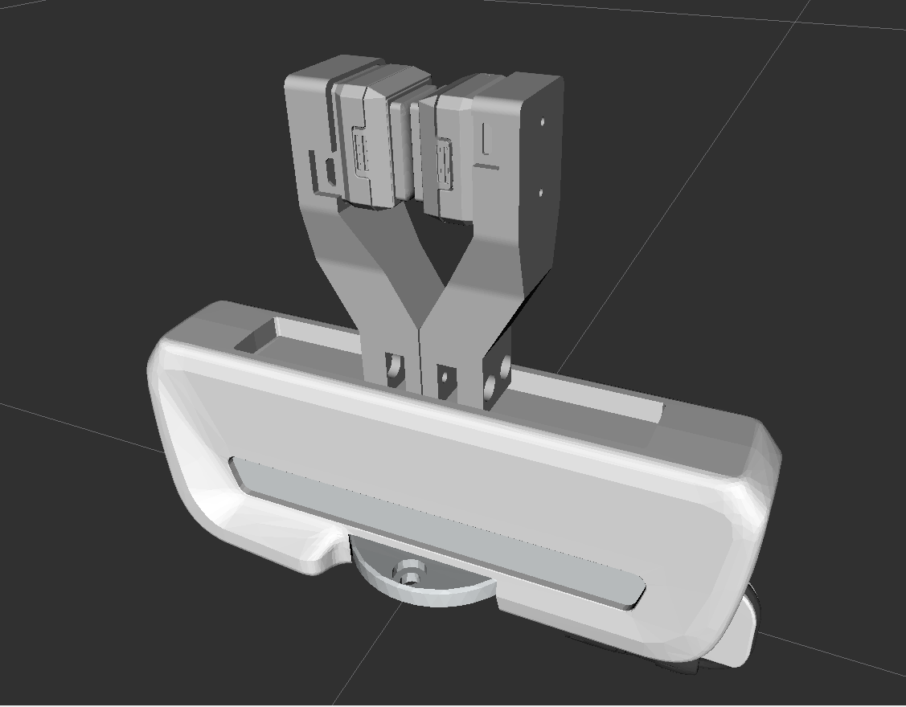

# gelsight_mini-on-franka_emika

Robot description package modified from [*franka_ros*](https://github.com/justagist/franka_panda_description) package.

Addtional, Gelsight Mini and Emika finger adapter is added to create the combined URDF. The calculation is conduct through CAD assembly result.

For now, the combined part is only hand+finger+gelsight mini for minimal research requirement.

## Usage
- The ready-to-use URDF files are in folder `description/urdf/`:
  - The `hand_origin.urdf` is **auto-generated** through `description/xacro/cv2urdf.py` and represents the original franka_panda.
  - The `hand_gemini.urdf` is **manual-adjusted** to replace original finger to adapter finger and add gelsight mini.
- For usage **inside rviz or ros-related env**, please replace `package://urdf_rviz_display` in the URDF to your customized package name!
- For usage **outside ros-related env**, please replace `package://urdf_rviz_display` in the URDF to the relative path!

## TODO
- [x] Adjust to adapt in RVIZ ENV
- [ ] Adjust to adapt in TACTO ENV
